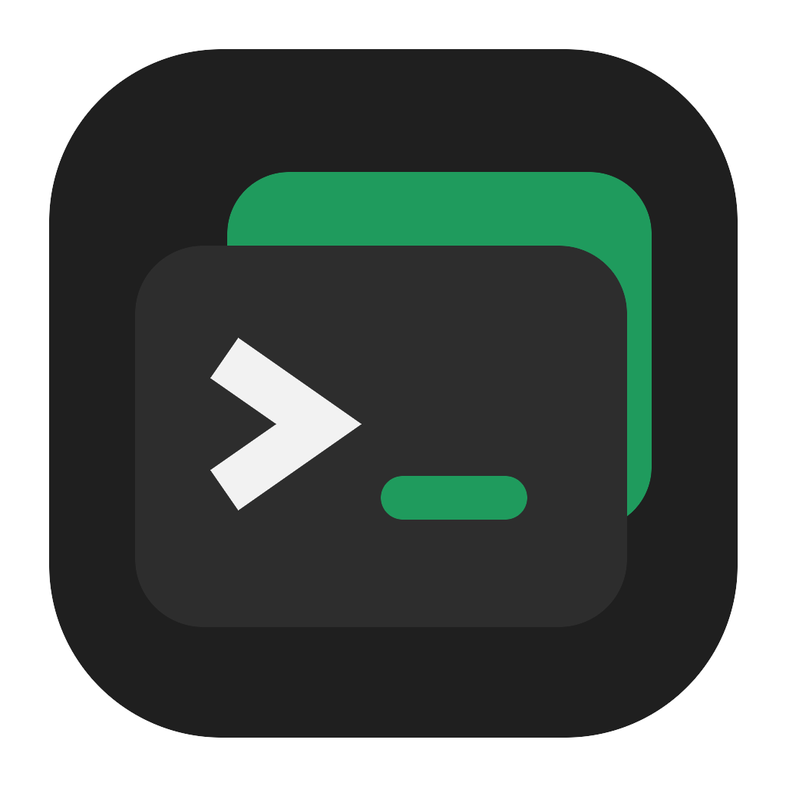

<p align="center">
  
</p>

<h1 align="center">SlotDeck</h1>

<p align="center">
  A plugin-first desktop workspace for terminals, code, browsing and local development services.
</p>

<p align="center">
  <a href="https://isocpp.org"></a>
  <a href="https://www.qt.io"></a>
  
</p>

<br>

## 🚀 Project

SlotDeck is a desktop application for people who need several shells, editors and local services
without losing the context of each task. Every product feature is a plugin discovered at runtime,
and the core owns only startup, the application shell, localization, messaging, persistence and the
shared visual primitives that every plugin builds on.

The interface stays compact and flat while making active terminals, layouts and background services
easy to identify. Preferences, workspace organization and plugin state are persisted in one SQLite
database under the platform local data directory and restored when the application starts again.

## 🧩 Plugins

| Plugin | Responsibility |
| --- | --- |
| **terminal** | Multipanel terminal workspaces, layouts, shelf, focus mode and terminal preferences |
| **code-editor** | Folder workspaces, syntax highlighting, EditorConfig and language-server integration |
| **browser** | Embedded tabbed browsing with ordered bookmark groups and session restoration |
| **ai** | Agent task workspaces with tool calling, provider APIs, command execution, artifacts, execution history and scheduling |
| **web-server** | Static web servers with configurable document root, lifecycle and request activity |
| **logs** | Centralized runtime logs with filtering, paging and explicit clearing |
| **system-information** | Operating-system and hardware discovery published as immutable snapshots |
| **donate** | Verified donation destinations and supporter presentation |

## ✨ Features

- [x] Runtime plugin discovery with validated identities, dependencies and navigation contributions
- [x] Multipanel layouts containing one to twelve terminal slots
- [x] Independent terminal sessions backed by native PTY or ConPTY processes
- [x] VT emulation through a pinned `libghostty-vt` integration shared by every plugin
- [x] Session shelf for terminals outside the active layout and focus mode for a single terminal
- [x] Source editing with built-in highlighting, EditorConfig resolution, diagnostics and completion
- [x] AI task workspaces where each task is a lasting conversation with a configured agent, or a command with its own working directory and time limit
- [x] Per-provider request pacing shared by every workspace, with automatic backoff when a service refuses a request
- [x] Embedded browser with persistent tabs, bookmark groups and drag reordering
- [x] Static web servers created from any folder, with request logging and lifecycle controls
- [x] Green, Blue and Red application themes applied without restarting plugin runtimes
- [x] English and Portuguese interface languages selected from the system locale or explicitly
- [x] Strict SQLite persistence with per-plugin schema versions and scoped table ownership
- [x] Complete configuration export and transactional import with atomic replacement
- [x] Deterministic teardown without dangling panes, processes or plugin workers
- [x] Native desktop packaging for macOS, Linux and Windows

## 🧰 Requirements

| Component | Requirement |
| --- | --- |
| C++ toolchain | C++20 support |
| Qt | Version 6.11.2 or newer, shared build, with Concurrent, Core, Gui, Network, Sql, WebEngine and Widgets |
| CMake | Version 3.28 or newer |
| Ninja | Current stable release |
| Zig | Required to build the pinned Ghostty dependency |
| Python | Version 3 with standard library only for the development helper |

Static Qt builds are rejected during configuration.

## 📦 Build

The development helper validates the local toolchain and drives the complete CMake workflow.

```bash
python3 make.py doctor
python3 make.py configure --configuration Debug
python3 make.py build --configuration Debug
```

## ▶️ Run

The run task builds the selected configuration before starting SlotDeck.

```bash
python3 make.py run --configuration Debug
```

## 🛠️ Development tasks

| Task | Purpose |
| --- | --- |
| **all** | Check formatting, run the audits, build and run the registered test suites |
| **audit** | Run the audits this project declares for itself |
| **build** | Compile the selected configuration |
| **clean** | Clean the selected build directory |
| **configure** | Generate Ninja build files with CMake |
| **coverage** | Generate HTML and Cobertura reports with full line and branch gates |
| **distclean** | Remove every generated build directory |
| **doctor** | Locate required and optional development tools |
| **format** | Format first-party C and C++ sources |
| **format-check** | Validate formatting without changing files |
| **lint** | Run those audits and then Cppcheck warning, performance and portability analysis |
| **models** | Rewrite the AI model catalog from a LiteLLM checkout |
| **package** | Create the native release package |
| **reset-data** | Remove the application database and every plugin state |
| **run** | Build and start the application |
| **sanitize** | Build with address and undefined-behavior sanitizers |
| **test** | Build and run the registered CTest suites |
| **validate-package** | Verify the produced package signature, plugins and dynamic Qt linkage |
| **version** | Print the current version or write a new `MAJOR.MINOR.PATCH` value |

## 🌐 Static web server

A web server is created from any selected folder and is independent from the terminal. The server
resolves directory requests through `index.html` or `index.htm`, serves assets with their detected
MIME type and rejects paths outside the configured document root.

A server may optionally link to one terminal session as an integration source. Closing that terminal
removes only the link and preserves the server configuration and its running instance. The Web Server
view lists existing instances and provides status, lifecycle controls and request activity.

## 🧱 Architecture

| Area | Responsibility |
| --- | --- |
| **src/app** | Process initialization and core composition |
| **src/plugins** | Plugin interface, discovery, lifecycle, localization and the asynchronous message bus |
| **src/ui** | Application shell, dynamic navigation, dynamic settings and the shared visual primitives |
| **src/terminal** | Shared terminal engine, shell profiles, ANSI catalogs and the platform PTY backends |
| **src/persistence** | Core state, transactions, schema versions and per-plugin database isolation |
| **src/filesystem** | Generic asynchronous file reads, atomic writes, creation, movement and removal |
| **plugins** | Every product feature, each one a Qt shared library implementing the plugin interface |

The `SlotDeckUi` library owns the shared visual primitives and is linked by the core, the terminal
engine and every plugin, so a change to a shared component reaches every consumer from one source.

## 🧠 AI model catalog

Every model the AI plugin offers lives in `plugins/ai/assets/models.json`, which the plugin carries
as a resource. Adding a model is one line of data, and a provider declares in code only which models
it opens with.

The file is rebuilt from a [LiteLLM](https://github.com/BerriAI/litellm) checkout, and whatever the
file already declared is kept, so a model added by hand survives a regeneration.

```bash
python3 make.py models /path/to/litellm
```

## 🤖 AI agents and task conversations

A task is a conversation held with an agent, and every run is one turn inside it. What was said stays
with the task, so an agent keeps what it already learned instead of starting from nothing each time.

An agent is created under AI Agents and carries a name, a stable identifier spelled from that name,
a description, the model connection it speaks through, its iteration limit and its own system prompt. There is no system
prompt written into the product, so what an agent is told is what you wrote for it.

The system prompt accepts tags from a closed set, and the dialog offers both a template that already
places them and the list of every tag with what it stands for. A tag nobody declares is refused when
the agent is saved rather than met by a run that cannot answer it.

| Tag | Stands for |
| --- | --- |
| `{{SYSTEM_PROMPT_DATA}}` | The working directory, the environment, the published context files and the skills of the task |
| `{{TASK_TITLE}}`, `{{TASK_PROMPT}}`, `{{TASK_WORKDIR}}` | What the task itself declares |
| `{{DATE_TIME}}`, `{{TIME_ZONE}}`, `{{OPERATING_SYSTEM}}` | The moment and the machine the run happens on |

A model that declares the system role receives the instructions as a system message, and one that does
not receives them as the first user message, decided from the capability the model catalog carries.

Opening a task replaces the board with its conversation. The composer stays enabled while a turn is
running: a message typed then joins the conversation at once and is carried into the next iteration of
that turn, and one that arrives while the final answer is being written opens the turn after it.
Running the task sends its prompt again as a new message, because that prompt is the standing
instruction a schedule repeats, and resetting the task clears the conversation together with the runs
it recorded.

Removing an agent is allowed and the tasks it was handed stop with the reason that names it, while a
connection an agent runs on is refused until no agent names it.

## 🚦 AI request limits

A hosted model service answers a limited number of requests, and an agent run reaches the model once
per iteration, so a single task can spend a whole minute of budget by itself. Every request to one
service waits in the same queue, whatever workspace, task or model connection asked for it, and the
pace of that queue is configured under AI Providers, which opens with the selector that names which
provider the settings below it belong to.

| Setting | What it does |
| --- | --- |
| **Delay between requests** | Minimum time between two requests reaching that service |
| **Maximum requests per minute** | Rolling one-minute window, which is the shape services usually publish their limits in |
| **Maximum requests at the same time** | How many requests may be in flight, where one suits a service that refuses concurrent calls |

The three compose, so a request leaves only once the delay has passed, the window has room and no
other request of that provider is still in flight. A zero means that limit was never declared, and a
provider left entirely at zero stores nothing.

Write the number the service publishes, leaving a little margin for the attempts a rejection costs.
A free tier documented at forty requests per minute is written as thirty-five with one request at a
time, and one documented at twenty requests per minute is written as eighteen. A daily quota is not
a rate, so no pacing avoids reaching it.

Rejections are handled without any configuration. A service that refuses a request because of its
rate is tried again after the delay it asked for, and otherwise after a wait that doubles from one
second up to the declared ceiling, because repeating a rejection immediately reproduces the
condition that caused it. A task that is waiting says so on its card and records every wait, with
its reason and duration, in the execution log of that run.

## 📦 Package

The package task creates a DMG on macOS, a compressed archive on Linux and a ZIP archive on Windows.

```bash
python3 make.py package
python3 make.py validate-package
```
